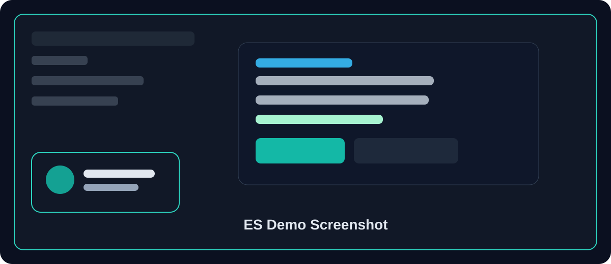

# Elasticsearch + Node.js (TypeScript) + React (Tailwind) Demo

A minimal product-search app: React frontend calls an Express/TypeScript API,
which queries Elasticsearch.

```
es-demo/
├── docker-compose.yml     # runs a local Elasticsearch node
├── backend/               # Express + TypeScript API
│   └── src/
│       ├── es-client.ts   # ES client + index setup
│       ├── seed.ts        # loads sample product data
│       └── server.ts      # /api/search and /api/products routes
└── frontend/              # React + TypeScript + Tailwind
    └── src/
        ├── App.tsx        # search UI
        └── main.tsx
```



## 1. Start Elasticsearch

You need Docker installed.

```bash
cd es-demo
docker compose up -d
```

Check it's up:

```bash
curl http://localhost:9200
```

## 2. Run the backend

```bash
cd backend
cp .env.example .env
npm install
npm run seed   # creates the index and loads 10 sample products
npm run dev    # starts the API on http://localhost:4100
```

Test it directly:

```bash
curl "http://localhost:4100/api/search?q=keyboard"
```

## 3. Run the frontend

```bash
cd frontend
npm install
npm run dev    # starts on http://localhost:5174
```

Open http://localhost:5174 — type in the search box and results come back
from Elasticsearch as you type (debounced), with an optional category filter.

## How the search query works

`GET /api/search?q=...&category=...` in `backend/src/server.ts` builds a
`multi_match` query across `name` (boosted) and `description`, with
`fuzziness: "AUTO"` so typos still match, plus an optional `term` filter on
`category`.

## Extending this

- Add more fields to the mapping in `es-client.ts` (e.g. tags, brand) and to
  `multi_match.fields`.
- Add pagination with `from`/`size`.
- Add aggregations (e.g. facet counts per category) via the `aggs` key in
  the search body, and render them in the frontend as filter checkboxes.
- Swap the fuzzy `multi_match` for a `function_score` query to factor in
  price or popularity.
- For production, put Elasticsearch behind authentication (the demo disables
  security for simplicity) and never expose it directly to the browser —
  always search through your own backend, as this demo does.
